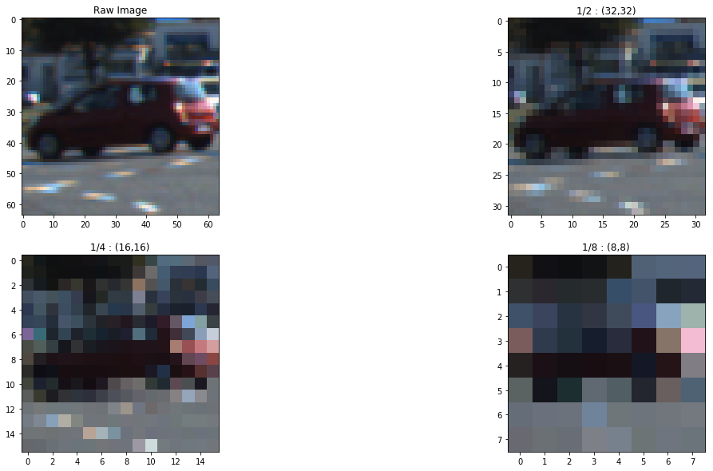

# Vehicle detection using HoG feature extraction and neural nets

**In this project, I will train multiple classifiers using color and gradient features to recognize vehicles, and perform a sliding window search in multiple scales to detect cars in a video stream.**

---

**What to look for in *notebook.ipyb*?**

- The three feature extraction functions, `get_hog_features`, `get_colorhist_features` and `get_spatialbin_features`
- The two feature assimilation functions, `get_single_img_feature` and `extract_features`
- `slide_window` function that takes in an array of regions and returns the windows associated with them
- `add_heat` and `apply_threshold` functions that deal with pruning out false positives
- `find_cars` function that takes in an array of regions, feature extraction parameters, classifier and returns the positive windows
- `add_new_frame` and `get_last_few_frame_positions` methods in `VideoProcessor` class that work on interframe averaging
- `process_img` method in `VideoProcessor` class that is the main pipeline for processing video frames

---

The scope of the project can roughly be broken into two distinct components:

1. Training a binary classifier to recognize vehicles vs not-vehicles
2. Localizing vehicles in an image and drawing bounding boxes around them

To accomplish these two goals, I will take the following steps:

- Extract color and gradient features from a labeled training dataset. For color related features, I will use spatial binning and color histogram on the saturation channel. For gradient related features, I will use Histogram of Oriented Features by Dalal and Triggs as described in [this paper](https://hal.inria.fr/file/index/docid/548512/filename/hog_cvpr2005.pdf).

- Train several classifiers to do binary classification, contrast them based on speed and accuracy and use the best one. I tried linear SVM, SVM with rbf kernel, random forest and deep neural nets.

- Implement a sliding-window technique in different scales and use my trained classifier to search for vehicles in different frames.

- Run my pipeline on a video stream and create a heat map of recurring detections frame by frame to reject outliers and follow detected vehicles.

- Estimate a bounding box for vehicles detected.

---

## Section 1, Building a Classifier

### Data Exploration

First I explore the labeled dataset given to me so that I get a feel of what it looks like. Below are some random **vehicle** and **not-vehicle** class examples.

    Size of images:
    (64, 64, 3)


---

### Feature extraction

In this section, I will explore and use three different techniques to extract features from training images that I think best represent the quality of vehicle-ness.

#### Histogram of Oriented Gradients

This technique computes first order image gradients that captures contour, silhouette and some texture information in the image, while providing further resistance to illumination variations. One of the excellent resources that helped me understand the concept was this post on the [official scikit website](http://scikit-image.org/docs/dev/auto_examples/features_detection/plot_hog.html).

There are several parameters involved when extracting features using HoG. Remember, we are trying to optimize for both speed and accuracy, and there is a trade off. The parameter values I choose will reflect this.

- `orientations` : Number of orientations. It can be understood as the total number of buckets for direction classification in a particular block. A value between 9-11 is suggested in the literature, and that's what I did.

- `block_norm` : The method to use for local block normalization. In this case, I have performed both local and global normalization to reduce the influence of illumination effects.

- `transform_sqrt` : Whether to apply global normalization using gamma compression or not.

- `cells_per_block` : The image is divided into blocks and blocks are divided into cells and cells into pixels.

- `feature_vector` : Whether to get a 1-D representation of the features or not

- `pixels_per_cell` : The number of pixels per cell. I started off with 8 and it was great except the classifier was horribly slow. I slowly increased it without having to sacrifice too much on accuracy. 14 was a good point to stop.


It can be seen how the hog features differ for vechiles and not-vehicles, and while 8 pixels per cell in both directions seems to have yielded the best result, it increased the video processing time a lot. I therefore regressed to 14 pixels per cell.

Also, I used features from multiple channels by converting the raw image into YCrCb color space as described in this [amazing paper](http://ieeexplore.ieee.org/abstract/document/5651637/).

#### Spatial Binning

In this technique, we just resize the image to a smaller "recognizable" size and use it as a feature. Let's scale down our image by several factors and use the best recognizable one.



As we can see for this particular image, `(32,32)` is a good tradeoff point. The image has been scaled by one-half, but I can still tell it is a car. If we had tons of computing power, we could just do `img.ravel()` on the original image and use it, but unfortunately that's not the case.

#### Color Histogram

In this technique, we try to extract any color-related features that gives us important information about vehicles. Like if we had to judge solely by the color profile of an image, what makes a car a car? Let's find out. I will draw a 3-D color space graph for several color spaces.

##### For vehicles


##### For not-vehicles


As we can see for these particular images, the distribution in RGB is relatively the same, but in the HLS diagram, the points are heavily concentrated in the lower-left corner of hue-saturation zone. So I will construct a 1-D histogram of the saturation channel of the training images and also use it as a feature.

After I extract all the features, I concatenate them into a neat 1-D array. With the parameters discussed above, the length of the feature vector turned out to be `4276`. This was the best bet I could get without sacrificing too much accuracy or speed.

---

### Training a classifier

I will train four different classifiers:

1. Support vector machines with linear kernel
2. Support vector machines with radial basis function(rbf) kernel
3. Random forest
4. Deep neural network

I will seek to pick the model that gives me optimal speed and accuracy.

#### Preparing training, validation and training data

We have 8792 vehicle examples and 8968 not-vehicle examples, which means it is a fairly balanced dataset. I have shuffled the dataset and divided it into training data, validation data and testing data. The test data was used only once (of course!).

I also standardized the features by removing the mean and scaling to unit variance. I used the same scaler object for my validation and testing data to avoid any bias to be added during the training process.

#### Support Vector Machines

SVMs are non-probabilistic binary classifiers that work by finding the maximum-margin hyperplane to separate the two classes. There is a problem, however, since there is no basis for us to assume that our training data is a folky linearly separable one. We can still use a linear SVM, but we need just the right parameters. One of those parameters is the value of `C` in scikit-learn. I found a really good explanation of `C` on stackexchange:

    In a SVM you are searching for two things simultaneously: a hyperplane with the largest minimum margin, and a hyperplane that correctly separates as many instances as possible. The problem is that you will not always be able to get both things. The C parameter determines how great your desire is for the latter.

So I am striving for balance here again, but I know that I don't want a large value of `C` as it will result in overfitting and a small value of `C` as it will result in underfitting. I did a grid search for multiple values of `C` and found a value of `1.0` to be the best.

```python
linear_svm_clf = svm.LinearSVC()
linear_svm_clf.fit(X_train, y_train)
print(linear_svm_clf.score(X_valid, y_valid))
```

    0.9916114790286976

I also tried using the kernel trick, i.e. projecting the training data to a higher dimensional space to introduce linear separability. Rbf kernel is considered to be the most versatile in the literature and that's why I gave it a shot. I gave me a wonderful result, no doubt, but was terribly slow in training (and later inference).

```python
rbf_svm_clf = svm.SVC()
rbf_svm_clf.fit(X_train, y_train)
print(rbf_svm_clf.score(X_valid, y_valid))
```

    0.992494481236

#### Random Forests

Random forests are nothing but a bunch of decision trees working in a parliament. You set up as a parameter deciding how many decision trees you want, and the depth you are willing to go to "purify" your data, which is based on entropy.Random decision forests are known to correct for decision trees' tendency to overfit.

```python
random_forest_clf = RandomForestClassifier(n_estimators=15, max_depth=10)
random_forest_clf.fit(X_train, y_train)
random_forest_clf.score(X_valid, y_valid)
```

    0.9814569536423841

#### Deep neural networks

Not so deep here. I started off by modifying gigantic model architectures like VGG-16, only to realize I could do the same thing with only two hidden layers with a few thousand parameters.

*Remarks:*

- I used Adam optimization method over simple gradient descent, the ‘momentum’ in Adam optimizer provides much faster convergence. It also means that I do not need to actively tune the learning rate.
- Small batch size yielded better validation accuracy.
- The model stopped improving in less than five epochs.

```python
batch_size = 16
num_classes = 2
epochs = 10
```

    _________________________________________________________________
    Layer (type)                 Output Shape              Param #   
    =================================================================
    input_1 (InputLayer)         (None, 4276)              0         
    _________________________________________________________________
    dense_1 (Dense)              (None, 100)               427700    
    _________________________________________________________________
    dropout_1 (Dropout)          (None, 100)               0         
    _________________________________________________________________
    dense_2 (Dense)              (None, 24)                2424      
    _________________________________________________________________
    dense_3 (Dense)              (None, 2)                 50        
    =================================================================
    Total params: 430,174
    Trainable params: 430,174
    Non-trainable params: 0
    _________________________________________________________________

```python
dnn_model.compile(optimizer='adam', loss='binary_crossentropy', metrics=['accuracy'])
dnn_model.fit(X_train, y_train_keras, batch_size, epochs, validation_data=(X_valid, y_valid_keras))

```

    Train on 12831 samples, validate on 2265 samples
    Epoch 1/10
    12831/12831 [==============================] - 9s 711us/step - loss: 0.0579 - acc: 0.9818 - val_loss: 0.0297 - val_acc: 0.9925
    Epoch 2/10
    12831/12831 [==============================] - 8s 656us/step - loss: 0.0236 - acc: 0.9933 - val_loss: 0.0247 - val_acc: 0.9960
    Epoch 3/10
    12831/12831 [==============================] - 7s 564us/step - loss: 0.0156 - acc: 0.9962 - val_loss: 0.0313 - val_acc: 0.9956
    Epoch 4/10
    12831/12831 [==============================] - 8s 590us/step - loss: 0.0134 - acc: 0.9964 - val_loss: 0.0357 - val_acc: 0.9936
    Epoch 5/10
    12831/12831 [==============================] - 6s 504us/step - loss: 0.0123 - acc: 0.9976 - val_loss: 0.0267 - val_acc: 0.9960
    Epoch 6/10
    12831/12831 [==============================] - 6s 505us/step - loss: 0.0160 - acc: 0.9970 - val_loss: 0.0449 - val_acc: 0.9927
    Epoch 7/10
    12831/12831 [==============================] - 7s 529us/step - loss: 0.0121 - acc: 0.9974 - val_loss: 0.0354 - val_acc: 0.9947
    Epoch 8/10
    12831/12831 [==============================] - 9s 733us/step - loss: 0.0069 - acc: 0.9981 - val_loss: 0.0218 - val_acc: 0.9974
    Epoch 9/10
    12831/12831 [==============================] - 12s 897us/step - loss: 0.0066 - acc: 0.9988 - val_loss: 0.0540 - val_acc: 0.9934
    Epoch 10/10
    12831/12831 [==============================] - 10s 789us/step - loss: 0.0103 - acc: 0.9979 - val_loss: 0.0388 - val_acc: 0.9954

#### Picking the best classifer

So far we have gotten more than 98% accuracy on all our classifiers. So we could use any of them. However, we want *both* speed and accuracy in inference.

*Rank (Best to worst):*

** Speed -** Linear SVM, Random forest, Deep Neural Net, SVM with rbf kernel

** Validation Accuracy -** Deep Neural Net, SVM with rbf kernel, Linear SVM, Random forest

*Classifier optimizations:*

1. For linear svm, I used a grid-search to find the optimal value of `C` which was found to be 1.

2. I tried different numbers of decision tree estimators and depth for random forest. 15 estimators and depth of 10 turned out to be a good tradeoff point.

3. I tried big architectures for the deep neural network with millions of parameters, only to realize that I didn't really need it. I did gain a negligible improvement in performance at the expense of a million or two parameters, but the architecture I came up with was a good stopping point.

Let's test these classifiers on the test data we have prepared.

    Linear SVM
    0.9906156156156156

    SVM with rbf kernel
    0.9927389089020349

    Random Forest
    0.98923721572157215

    Deep Net
    2664/2664 [==============================] - 0s 119us/step
    0.9941816816816816

I like the extra accuracy of deep net and its speed too, so it will be my primary choice. Linear SVM is my second choice. The non-linear SVM with rbf kernel while yielded an astonishingly good accuracy was excruciatingly slow.

---

## Section 2, Vehicle detection

In this section , we will use the classifier we developed above to detect vehicles in images.

### Sliding Window Search

Now that we have a solid classifier, we can examine different patches in a frame by sliding a window across the region where vehicles are most likely to show up. This is a summary of how the process went for me:

- Created a `Region` class and a list of `Region` instances to describe the interested search region.

``` Python
class Region:
    def __init__(self, xstart, xstop, ystart, ystop, cells_per_step, scales):
        self.xstart = xstart
        self.xstop = xstop
        self.ystart = ystart
        self.ystop = ystop
        self.cells_per_step = cells_per_step
        self.scales = scales
```

- I tried a *LOT* of combinations. I got more false positives with scales less than 1 and scales greater than 2 did not yield any better results.

- Surprisingly, there were a lot fewer false positives with the neural net model than with linear svm. The difference in the inference time was almost negligible.

- I created a list of three region instances. The first has 1 cell per step and covers mostly the upper part of our ROI. It has two scales. The second one is like the first one but does another search with a different scale on the right side of the image. The third one has two cells per step and is concerned with mostly the bottom of the image with relatively bigger scan scale.

``` Python
    regions = [
        Region(xstart=110, xstop=1280, ystart=400, ystop=560, cells_per_step=1, scales=[1,1.3]),
        Region(xstart=900, xstop=1280, ystart=400, ystop=560, cells_per_step=1, scales=[1.15]),
        Region(xstart=110, xstop=1280, ystart=500, ystop=680, cells_per_step=2, scales=[1.25])
    ]
```

**Note:** The performance of the pipeline will be directly determined by the number of regions used, number of scales per region, number of cells per step and size of the window. This was the hardest part since it required a lot of tuning to find just the right parameters. I am fairly certain that there is a lot of room for improvement in terms of getting the right parameters, but there is not much learning involved in this process, so I only spent a few days trying to do this.

### Removing false positives and aggregating boxes

To remove false positives, I draw bounding boxes around high-confidence detections where multiple overlapping detections occur. The "multiple overlapping detections" is a threshold value, and I didn't have to tune it much. I played with 1 and 2, but settled with 1.

---

## Testing the pipeline

I have a `VideoProcessor` class that can do interframe averaging. This is reflected in the video. Let's try our pipeline on some test images.


---

## Reflection

1. This was the most technically challenging projects of all, which meant I spent a good deal of time learning a lot of cool things.

2. Nudging the parameters to get smooth detections took a long time and was probably my least favorite part of this project. There is still so much more to do, but since it doesn't involve a whole lot of learning per se, I stopped at one point. I however came up with better ways of nudging parameters which is good.

3. Time permitting, I want to try the same project with other end-to-end methods like YOLO.

4. My interframe averaging is working, but not the best it can be.

5. The pipeline would fail in severe lighting or weather conditions. Some parameters are hard-coded, so it would probably also not work for detecting vehicles in all kinds of video frames.

6. The pipeline takes about 1-2 seconds per frame to process. There ia a room for improvement, definitely, but I started with about 15 seconds per frame, so that's an achievement.

---

**Link to the youtube video:**
[https://youtu.be/E66a8GFWlno](https://youtu.be/E66a8GFWlno)

